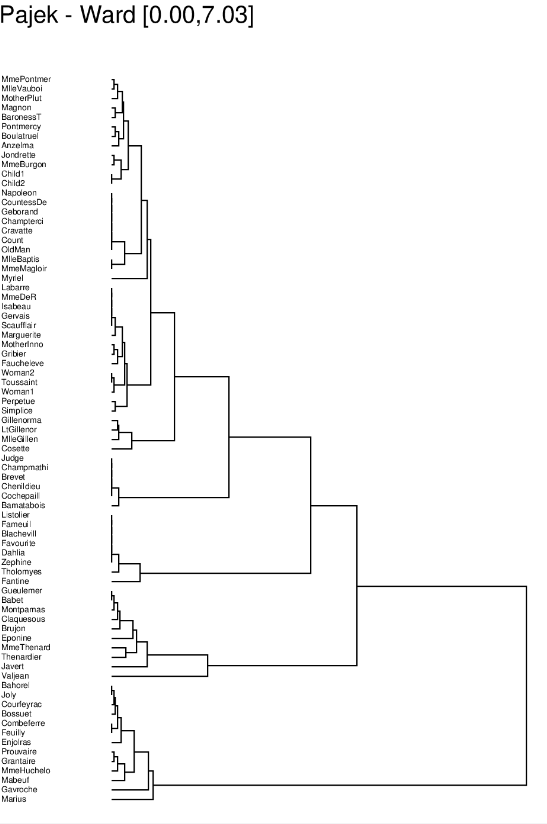
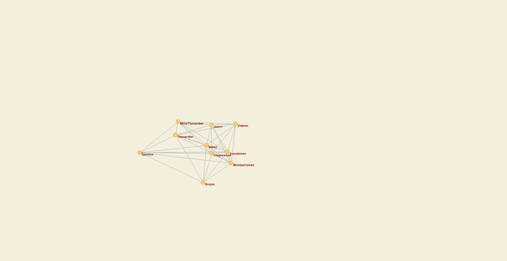
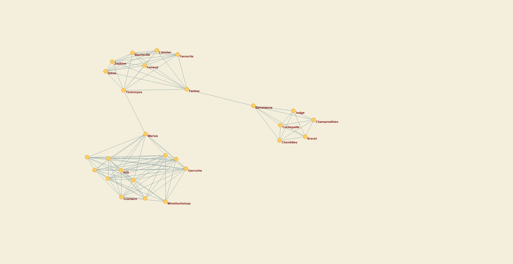

# Report
## Task A
Using Pajek, analyze a “small” graph, i.e. of a size that allows the use of standard visualization and clustering algorithms.

### Preparation
For project preparation, the Pajek software was [downloaded](http://mrvar.fdv.uni-lj.si/pajek/) along with the provided [graph data](https://www.ia.pw.edu.pl/%7Emkamola/dataset-small/6.net).

### Examine the order and size of the entire network, then extract the largest connected component, examine its row and size

The original graph Pajek analysis has resulted in hereby summary:
```
Number of vertices (n): 77
----------------------------------------------------------
                                       Arcs          Edges
----------------------------------------------------------
Total number of lines                     0            254
----------------------------------------------------------
Number of loops                           0              0
Number of multiple lines                  0              0
----------------------------------------------------------

Density1 [loops allowed]    = 0.08568055
Density2 [no loops allowed] = 0.08680793
Average Degree = 6.59740260
```
Therefore, the original order of the whole graph is N=77 and the size is E=254. After the extraction of the weak connected components (as the graph is undirected, it doesn't matter if we analyze strong or weak), the obtained results are as follows:
```
Weak Components of N1 [>=1] (77, comp.=1)
==============================================================================
Dimension: 77
The lowest value:  1
The highest value: 1

Frequency distribution of cluster values:

   Cluster      Freq     Freq%   CumFreq  CumFreq% Representative
 ----------------------------------------------------------------
         1        77  100.0000        77  100.0000 Myriel
 ----------------------------------------------------------------
       Sum        77  100.0000

```
The results indicate, the whole given graph is the single connected component, with same row and size as the original one.

### Plot the largest connected component and comment on the result



The result is expected, as the network represents the plot of the book there was a high probability for the heroes of the story operating in the same environment without seperated stories as in The Master And Margarita.

### Perform clustering using Ward's method with the d1 metric

With Pajek, the D1 Dissimilarity matrix between a given Net and it's compleate form along with dendrogram has been created as shown on the figure underneath.
```
==============================================================================
Dissimilarities
==============================================================================
 Working...

 N(v) are All neighbours of vertex v.
 | stands for set cardinality.
 + stands for symmetric sum of sets.
 1st maxdegree and 2nd maxdegree stand for largest degree and second largest degree in network, respectivelly.

 d1(u,v) = | N(u) + N(v) | / (1st maxdegree + 2nd maxdegree)

 Time spent:  00:00:00

==============================================================================
Hierarchical Clustering
==============================================================================
 Working...
 Creating dendrogram.eps....finished. Time needed: 00:00:00
 Time spent:  00:00:00
```

### Draw dendrogram and propose the cut
The initial dendrogram has been drawn as follows:

 
Afterwards, the cut was performed on the nodes with dissimilarity higher then 1, that could be interpreted by a statement "Characters in a single cluster does not have on average an interaction from outside of the cluster".

```
==============================================================================
Creating Partition from Hierarchy
==============================================================================
 Time spent:  0:00:00

==============================================================================
5. From Hierarchy H1 (77)
==============================================================================
Dimension: 77
The lowest value:  0
The highest value: 2

Frequency distribution of cluster values:

   Cluster      Freq     Freq%   CumFreq  CumFreq% Representative
 ----------------------------------------------------------------
         0        27   35.0649        27   35.0649 Tholomyes
         1        40   51.9481        67   87.0130 Myriel
         2        10   12.9870        77  100.0000 Valjean
 ----------------------------------------------------------------
       Sum        77  100.0000
```

### Draw the acquired clusters

The resultiong clusters are shown on the graphs below. The results indicate a two highly connected groups (with one of them being 3-modal via 2 bridges) and one group, that is loosely tied together by a single interactions.






## Task B