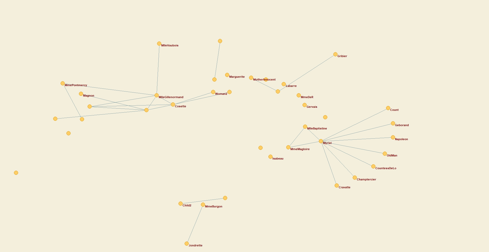
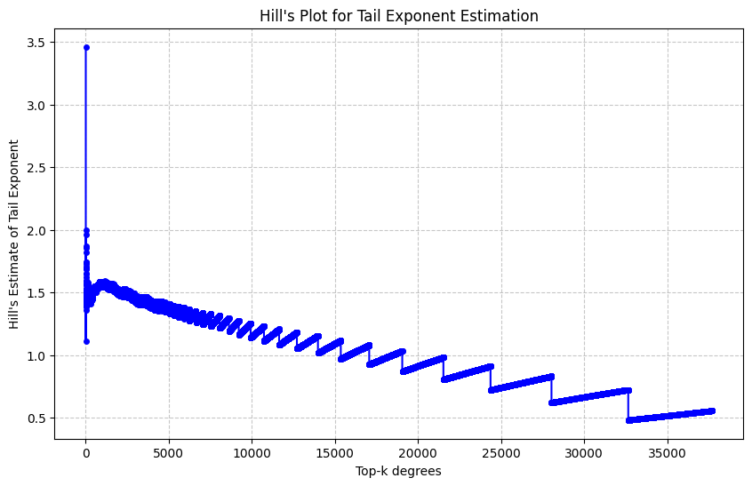

# Report
## Task A
Using Pajek, analyze a “small” graph, i.e. of a size that allows the use of standard visualization and clustering algorithms.

### Preparation
For project preparation, the Pajek software was [downloaded](http://mrvar.fdv.uni-lj.si/pajek/) along with the provided [graph data](https://www.ia.pw.edu.pl/%7Emkamola/dataset-small/6.net).

### Examine the order and size of the entire network, then extract the largest connected component, examine its row and size

The original graph Pajek analysis has resulted in hereby summary:

```
Number of vertices (n): 77
----------------------------------------------------------
                                       Arcs          Edges
----------------------------------------------------------
Total number of lines                     0            254
----------------------------------------------------------
Number of loops                           0              0
Number of multiple lines                  0              0
----------------------------------------------------------

Density1 [loops allowed]    = 0.08568055
Density2 [no loops allowed] = 0.08680793
Average Degree = 6.59740260
```

Therefore, the original order of the whole graph is N=77 and the size is E=254. After the extraction of the weak connected components (as the graph is undirected, it doesn't matter if we analyze strong or weak), the obtained results are as follows:

```
Weak Components of N1 [>=1] (77, comp.=1)
==============================================================================
Dimension: 77
The lowest value:  1
The highest value: 1

Frequency distribution of cluster values:

   Cluster      Freq     Freq%   CumFreq  CumFreq% Representative
 ----------------------------------------------------------------
         1        77  100.0000        77  100.0000 Myriel
 ----------------------------------------------------------------
       Sum        77  100.0000

```

The results indicate, the whole given graph is the single connected component, with same row and size as the original one.

### Plot the largest connected component and comment on the result


The result is expected, as the network represents the plot of the book there was a high probability for the heroes of the story operating in the same environment without seperated stories as in The Master And Margarita.

### Perform clustering using Ward's method with the d1 metric

With Pajek, the D1 Dissimilarity matrix between a given Net and it's compleate form along with dendrogram has been created as shown on the figure underneath.

```
==============================================================================
Dissimilarities
==============================================================================
 Working...

 N(v) are All neighbours of vertex v.
 | stands for set cardinality.
 + stands for symmetric sum of sets.
 1st maxdegree and 2nd maxdegree stand for largest degree and second largest degree in network, respectivelly.

 d1(u,v) = | N(u) + N(v) | / (1st maxdegree + 2nd maxdegree)

 Time spent:  00:00:00

==============================================================================
Hierarchical Clustering
==============================================================================
 Working...
 Creating dendrogram.eps....finished. Time needed: 00:00:00
 Time spent:  00:00:00
```

### Draw dendrogram and propose the cut
The initial dendrogram has been drawn as follows:


 
Afterwards, the cut was performed on the nodes with dissimilarity higher then 1, that could be interpreted by a statement "Characters in a single cluster does not have on average an interaction from outside of the cluster".

```
==============================================================================
Creating Partition from Hierarchy
==============================================================================
 Time spent:  0:00:00

==============================================================================
5. From Hierarchy H1 (77)
==============================================================================
Dimension: 77
The lowest value:  0
The highest value: 2

Frequency distribution of cluster values:

   Cluster      Freq     Freq%   CumFreq  CumFreq% Representative
 ----------------------------------------------------------------
         0        27   35.0649        27   35.0649 Tholomyes
         1        40   51.9481        67   87.0130 Myriel
         2        10   12.9870        77  100.0000 Valjean
 ----------------------------------------------------------------
       Sum        77  100.0000
```

### Draw the acquired clusters

The resultiong clusters are shown on the graphs below. The results indicate a two highly connected groups (with one of them being 3-modal via 2 bridges) and one group, that is loosely tied together by a single interactions.





## Task B
Downloaded a network of cooperations on Github

### Examine what is the row and size of the entire network original and after removing loops and duplicate edges
The results indicate the network provided does not contain loops and duplicate edges, as the row and size of original and cleaned are the same.

```
Original Graph:
Order (Number of Nodes): 37700
Size (Number of Edges): 289003

Cleaned Graph:
Order (Number of Nodes): 37700
Size (Number of Edges): 289003
```

This might be due to the analytical pre-preparation of the dataset by well established IT-services provider.

### Extract the largest connected component, examine its order and size
Due to the fact the graph is connected, largest connected component has the same order and size as the original graph

### Determine the approximations of the average path length, operating on a random sample of 100, 1000 and 10 thousand pairs of vertices
The approximations has been made and acquired results as follows:

```
Approximate Average Path Length with 100 samples: 3.21
Approximate Average Path Length with 1000 samples: 3.259
Approximate Average Path Length with 10000 samples: 3.2448
```

The more datapoints, the more reliable the approximation is, however in this scenario it can be pointed out that even 100x less approximation points result in a quite similar result. The result can be interpreted as "Between a random persons in the social network, it takes on average only about 3 users in between to contact them".

### Determine the number of cores with the largest possible order, with the second largest possible order with the third largest possible order; what are these orders?
The results are as follows:

```
Core Analysis:
Largest Core Level: 1, Number of Nodes: 5236
2nd Largest Core Level: 2, Number of Nodes: 4916
3rd Largest Core Level: 3, Number of Nodes: 3945
```

The results in terms of Core levels could have been forseen easily, as for each k-core, the cores with a bigger k are same or smaller. Therefore, always the three largest amount of the vertices (orders of the k-core subgraph) will be observed on the k-cores of k={1, 2, 3}.

### plot the vertices degree distribution
The graphic acquiret as result is as follows:


Please, be aware the X-axis and Y-axis are in log scale. The distribution indicates the approximately exponential decline in the degree of the graph nodes, with a few outliers breaking limit of cca. 50 contacts. Those outliers can be described as a biggest integrators among the network.

### Determine the exponent of the power distribution using the regression method for the complement of the degree distribution distribution, for logarithmically distributed intervals
o determine the exponent of a power-law distribution for the degree distribution, we can use a log-log regression method on the complementary cumulative distribution function (CCDF) of the degree distribution. First, you have to compute the degree distribution and calculate the CCDF, which shows the probability P(X>=x) for each degree x, then group degree values into logarithmically spaced intervals to reduce noise, especially for high-degree values and at last perform a log-log linear regression, using the log of the degree (x-axis) and the log of the CCDF (y-axis) to estimate the exponent.
The results of calculations are as follows:


```
Estimated power-law exponent (slope): -1.27
R-squared of the fit: 0.975
```

The R-squared indicate the exponent is very reliable, therefore the -1.27 value is a good fit for approximation function. The real-life impact can include easy assumtion the distribution is heavy-tailed (includes people with a very high connectivity while most are low).

### Determine Hill's plot
Hill's plot is a tool used in extreme value theory and power-law analysis to estimate the tail index of a distribution. This method is particularly useful for examining heavy-tailed distributions like the degree distributions in large-scale networks. Hill's plot allows you to visually assess the stability of the estimated tail index (exponent) by plotting the index across different numbers of observations from the tail.



The stable flat-like regions along the X-axis indicate a reliable estimate of the tail exponent, while an unstable regions point out to the garph not following a power-law distribution. In our case we can observe some degree of stability at the endo f the tail, however most of the graph remain unstable.